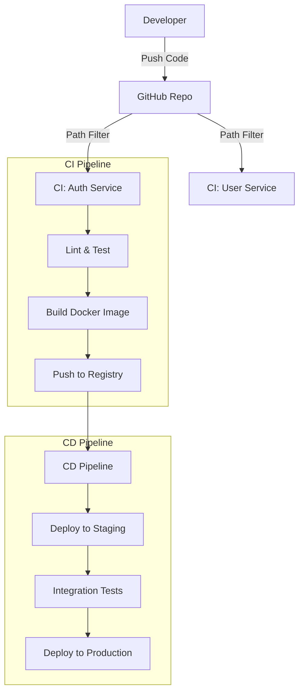
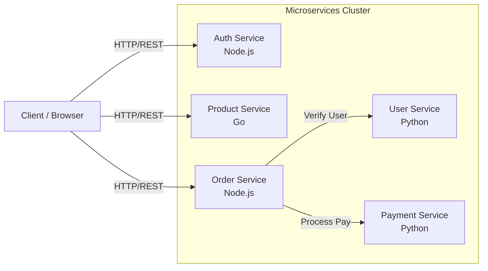

# CI/CD Pipeline Design for Microservices

## 1. Overview
This project demonstrates a robust CI/CD pipeline for a distributed application consisting of 5 independent microservices. The design focuses on **independence**, **scalability**, and **automation**.

### Services
1.  **Auth Service** (Node.js)
2.  **User Service** (Python/Flask)
3.  **Product Service** (Go)
4.  **Order Service** (Node.js)
5.  **Payment Service** (Python/Flask)

## 2. Version Control Strategy: Monorepo
We have chosen a **Monorepo** strategy (single repository for all services) for the following reasons:
*   **Unified Codebase**: Easier to manage shared configurations and observe cross-service changes.
*   **Simplified Dependency Management**: Easier to standardize tools and CI scripts.
*   **Atomic Commits**: Ability to change multiple services in a sync (though we deploy independently).

To ensure **independence**, our CI/CD pipelines use **path-based filtering**. A change in `services/auth-service` will *only* trigger the pipeline for the Auth Service, not the others.

## 3. Tool Chain
*   **Version Control**: Git (GitHub)
*   **CI/CD Orchestrator**: GitHub Actions
    *   Why? Native integration with GitHub, free for public repos, excellent support for matrix builds and path filtering.
*   **Containerization**: Docker
    *   Why? Standard for microservices, ensures consistency across dev/test/prod.
*   **Registry**: Docker Hub (or GitHub Container Registry)
*   **Deployment**: Kubernetes (simulated via Helm/Manifests in CD step)

## 4. Pipeline Architecture

### CI Pipeline (Continuous Integration)
Trigger: Push to `main` or Pull Request affecting `services/<service-name>/**`.

1.  **Checkout Code**: Fetch the latest code.
2.  **Language Setup**: Install Node/Python/Go based on service.
3.  **Lint & Test**:
    *   **Node.js**: Runs `npm test` (Mocha).
    *   **Python**: Runs `pytest` and `flake8` for linting.
    *   **Go**: Runs `go test` and `go fmt`.
4.  **Build Container**: Build Docker image tagged with commit SHA.
5.  **Push to Registry**: Push image to container registry (e.g., `myrepo/auth-service:sha-123`).

### CD Pipeline (Continuous Deployment)
Trigger: Successful completion of CI on `main` branch.

1.  **Deploy to Staging**: Update staging environment with new image.
2.  **Integration Tests**: Run automated API tests against Staging.
3.  **Deploy to Production**: (Manual approval or automated) Update production environment.

## 5. YAML Workflow Implementation
The core of our modular design is **Path Filtering**. Here is an example configuration from `auth-service-ci.yml`:

```yaml
on:
  push:
    branches: [ main ]
    paths:
      - 'services/auth-service/**' # <--- ONLY triggers when this folder changes
      - '.github/workflows/auth-service-ci.yml'
```

This ensures that if a developer modifies the **Product Service**, the **Auth Service** pipeline is NOT triggered, saving resources and ensuring isolation.

## 6. Architecture Diagrams

### 6.1 CI/CD Pipeline Flow
*(Note: This diagram renders visually on GitHub. If you see code below, use a Mermaid-compatible viewer.)*

This diagram illustrates how code changes flow from the developer to production, highlighting the independent paths.



### 6.2 System Architecture (Microservices)
This diagram shows the runtime environment where the 5 independent services operate.



## 7. Scalability & Modularity
*   **Modularity**: Achieved via Monorepo path filtering. Each service has its own `Dockerfile`, `package.json`/`requirements.txt`, and CI YAML.
*   **Scalability**: Services are stateless containers. They can be independently scaled in Kubernetes (e.g., 5 replicas of Auth, 2 of User).
*   **Reliability**: Automated testing (Unit & Linting) prevents bad code from reaching the registry.
